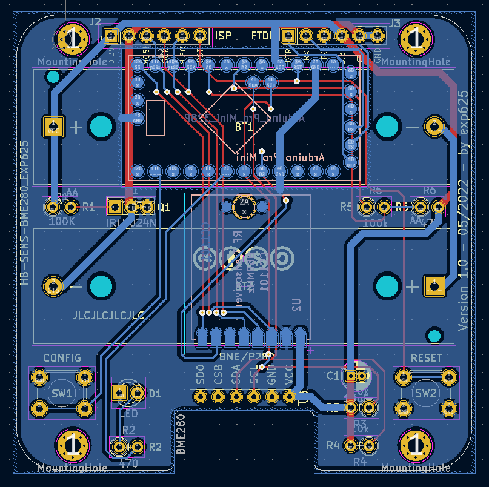
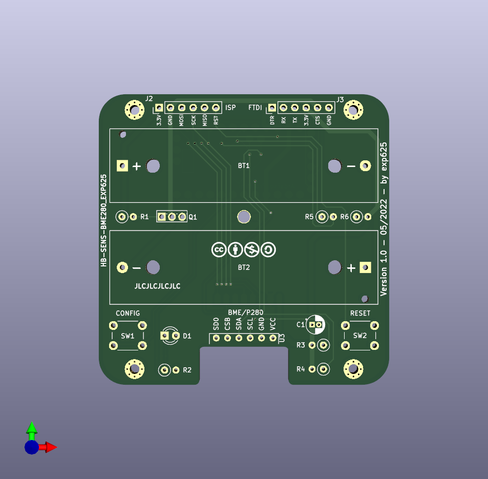
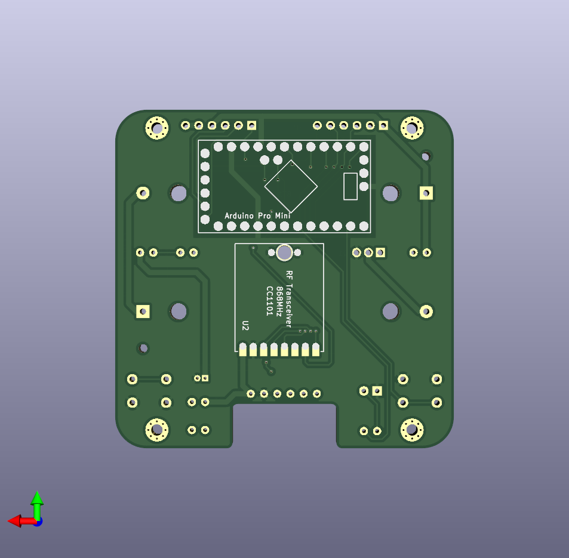
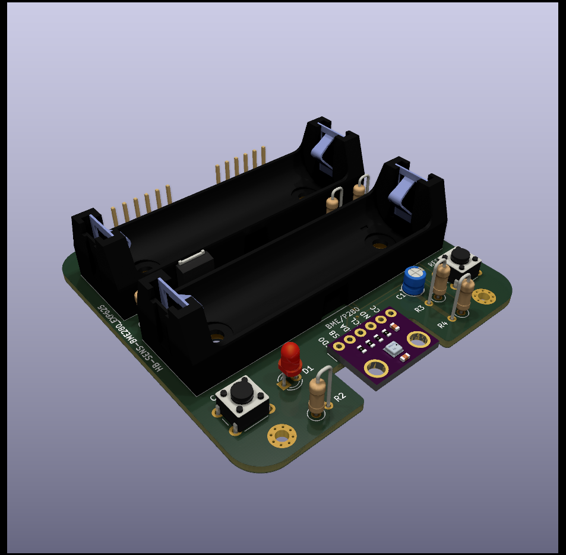
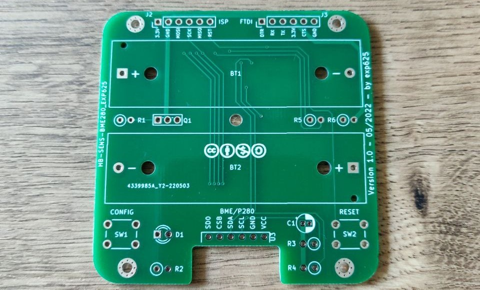
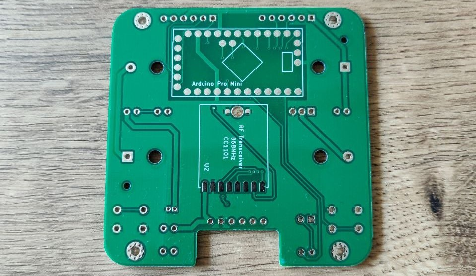
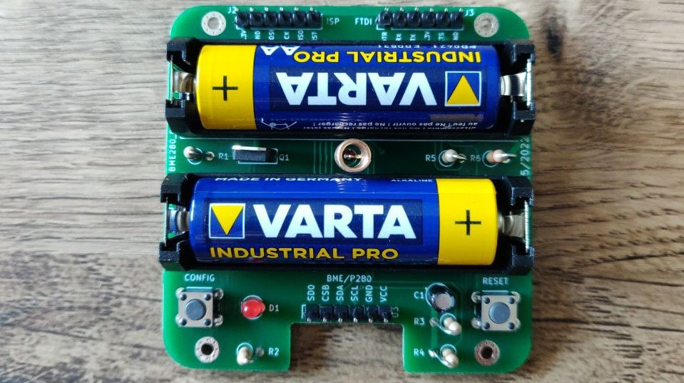
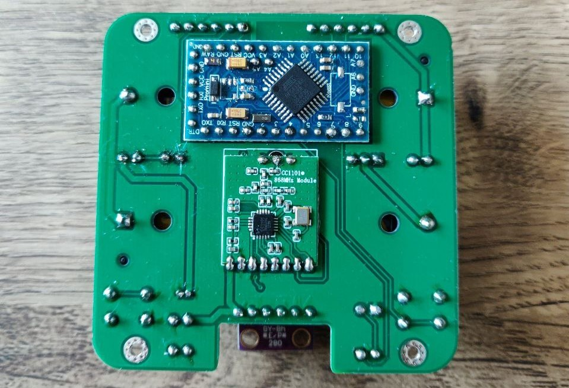

# HB-SEN-BME280_EXP625

**PCB for DIY AsksinPP++ Temperature/Humidity/Pressure sensor based on a BOSCH BME280 sensor and an Arduino Pro Mini**

## Credits

- This PCB is derived from FUEL4LP's PCB [HB-UNI-SEN-BATT_FUEL4EP](https://github.com/FUEL4EP/HomeAutomation/tree/master/AsksinPP_developments/PCBs/HB-UNI-SEN-BATT_FUEL4EP) and [HB-UNI-SEN-BATT_ATMega1284P_E07-868MS10_FRAM_FUEL4EP ](https://github.com/FUEL4EP/HomeAutomation/tree/master/AsksinPP_developments/PCBs/HB-UNI-SEN-BATT_ATMega1284P_E07-868MS10_FRAM_FUEL4EP).

## Changes

- Smaller PCB footprint to fit into the CBRS02VWH case
- surface mount assembly of the arduino and c1101 module to save space
- specific to one bme280 chip, everything else removed
- additional reset button, because the onboard reset button of the arduino needs to be removed due to the height.

## Hands-on test

The provided gerber files were used to order the pcb from JLCPCB and assemble 4 sensors, which are working perfectly for some time now

## Part List

| Count | Part                 | Label      |
|-------|----------------------|------------|
| 1     | IRLU024N             | Q1         |
| 2     | Resistor 100 kOhm    | R1,R5      |
| 1     | Resistor 470 Ohm     | R2         |
| 2     | Resistor 10 kOhm     | R3,R4      |
| 1     | Resistor 220 kOhm    | R6         |
| 1     | 10uF RM 1.5          | C1         |
| 3     | 6 Pin Jumper 2.54mm  | J1, J2, J3 |
| 2     | Battery Holder 6S-AA | BT1, BT2   |
| 1     | Arduino Pro Mini     | U1         |
| 1     | C1101 RF Module      | U2         |
| 1     | BME280 3.3V Devboard | U3         |
| 1     | Red 3mm LED          | D1         |
| 2     | Button 6x6mm         | SW1,SW2    |

Remove onboard leds, button and voltage regulator from the arduino board.
