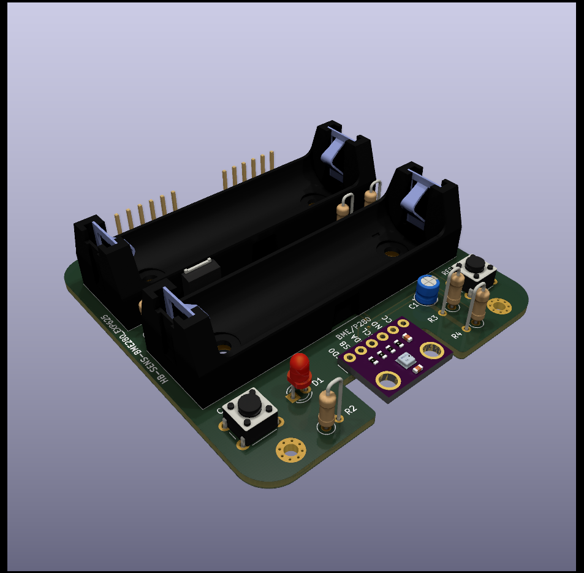

# HB-SEN-BME280_EXP625
[]
**PCB for DIY AsksinPP++ Temperature/Humidity/Pressuresensor based on a BOSCH BME280 sensor and an Arduino Pro Mini

## Credits

- diese Platine ist von FUEL4LP's Platine [HB-UNI-SEN-BATT_FUEL4EP](https://github.com/FUEL4EP/HomeAutomation/tree/master/AsksinPP_developments/PCBs/HB-UNI-SEN-BATT_FUEL4EP) sowie [HB-UNI-SEN-BATT_ATMega1284P_E07-868MS10_FRAM_FUEL4EP ](https://github.com/FUEL4EP/HomeAutomation/tree/master/AsksinPP_developments/PCBs/HB-UNI-SEN-BATT_ATMega1284P_E07-868MS10_FRAM_FUEL4EP) abgeleitet.
-
